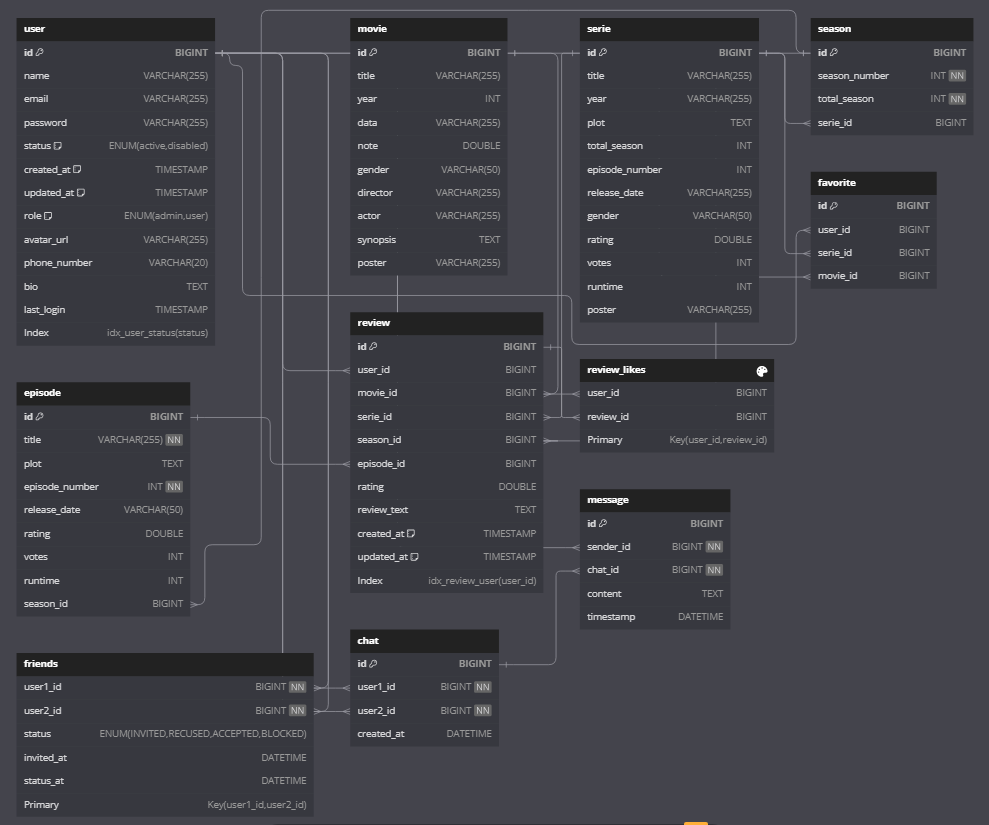
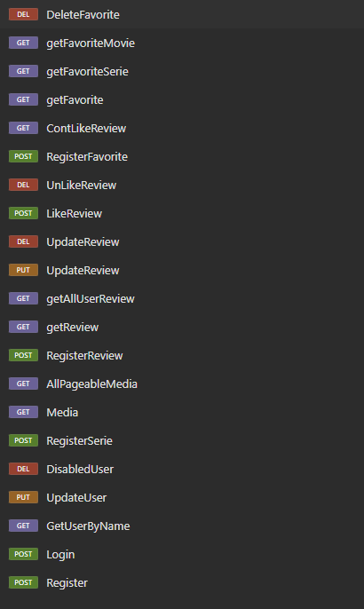

<h1>CineTrack</h1>

Uma API de avaliações de series e filmes

<h1>Funcionalidades</h1>
<ol>
	<li>Cadastro/login</li>
	<li>Atualizar informacoes de usuario</li>
	<li>Exibe perfis de usuarios existentes</li>
	<li>Adicionar series/filmes nao existentas no Banco de dados coletando do omdb</li>
	<li>CRUD Review de serie/season/episode</li>
	<li>CRUD Favoritos retornando formatado as series e filmes</li>
	<li>Sistema de curtidas para reviews</li>
	<li>Sistema de amigos</li>
	<li>Chat de conversas entre amigos em tempo real</li>
</ol>

<h1>Diagrama do Banco de Dados</h1>
<h1></h1>

<h1>Endpoints</h1>
<h1></h1>
